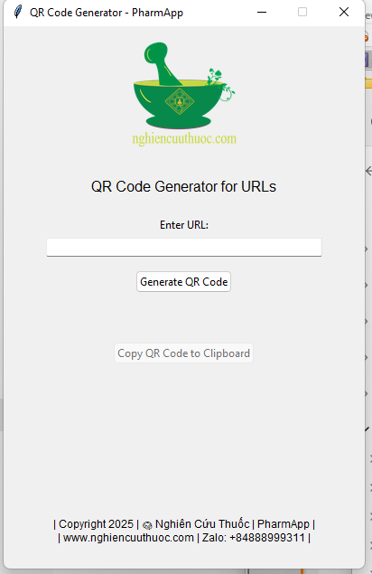

# 🧪 QR Code Generator - PharmApp Edition

A simple Tkinter-based GUI application to generate QR codes from URLs with a beautiful header and clipboard support.

 <!-- optional -->

---

## 🚀 Features

- 🎯 Generate QR Code from any URL
- 🖼️ Displays your logo at the top center
- 📝 Custom subtitle and footer with branding
- 📋 One-click **Copy QR Code to Clipboard**
- 💡 Built with Tkinter, Pillow, and pywin32

---

## 📦 Requirements

- Python 3.8 or higher
- Dependencies:
  - `qrcode[pil]`
  - `pillow`
  - `pywin32`

Install via pip:
```bash
pip install -r requirements.txt
